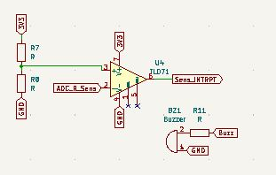

# 2021-2022-BOUKEZZATA-BERTON-MESLOUH

<div id="top"></div>
<!--
*** Thanks for checking out the Best-README-Template. If you have a suggestion
*** that would make this better, please fork the repo and create a pull request
*** or simply open an issue with the tag "enhancement".
*** Don't forget to give the project a star!
*** Thanks again! Now go create something AMAZING! :D
-->


<!-- PROJECT SHIELDS -->
<!--
*** I'm using markdown "reference style" links for readability.
*** Reference links are enclosed in brackets [ ] instead of parentheses ( ).
*** See the bottom of this document for the declaration of the reference variables
*** for contributors-url, forks-url, etc. This is an optional, concise syntax you may use.
*** https://www.markdownguide.org/basic-syntax/#reference-style-links
-->
<!-- PROJECT LOGO -->
<br />
<div align="center">
  
  <h3 align="center">Smart Device</h3>
</div>


<!-- TABLE OF CONTENTS -->
<details>
  <summary>Table of Contents</summary>
  <ol>
    <li>
      <a href="#about-the-project">About The Project</a>
    </li>
    <li>
      <a href="#LoRA">Lora</a>
    </li>
    <li><a href="#LoRAWAN">LoRAWAN</a></li>
    <li><a href="#KiCAD">KiCAD</a></li>
    <li><a href="#DATASHEET">DATASHEET</a></li>
  </ol>
</details>


<!-- ABOUT THE PROJECT -->
## About The Project
After manufacturing the gas sensor, we would like to design a system from an ESP32 microcontroller to retrieve the data collected from the sensor and communicate the detection of a specefic gas towards a server with a LoRA module

<p align="right">(<a href="#top">back to top</a>)</p>


<!-- GETTING STARTED -->
## LoRA

We used the <a href="https://github.com/jpmeijers/RN2483-Arduino-Library.git"> RN2483@jpmeijers </a> library to connect the Lora module to the TTN server "The Things Network".

We've connected the 3 pins of the LoRA module to the ESP32
<br/>
```cpp
#define RST 21 //Pin de reset du module LORA
#define RX 18  //Pin RX du module LORA
#define TX 19  //Pin TX du module LORA
```
And We used the serial port 2 (baud 57600) of the ESP32 to communicate with the RN2483
```cpp
rn2xx3 lora(Serial2);
```
To use the simple radio communication. you have to send with the serial monitor connected to your PC this commande (`radio tx "hexa_msg"`)
<div>  </div>
To receive radio communication, you only have to listene on the serail port 2
All the RN2483 command lines end with "\r\n"

```cpp
void initialize_radio()
{
  pinMode(RESET, OUTPUT);
  digitalWrite(RESET, LOW);
  delay(100);
  digitalWrite(RESET, HIGH); //reset the RN2483

  delay(100); //wait for the RN2xx3's startup message
  Serial2.flush();
}

void setup()
{
  Serial.begin(9600);
  Serial2.begin(57600, SERIAL_8N1, RXD2, TXD2);
  initialize_radio();
  Serial.println(Serial2.readStringUntil('\n'));
  Serial2.print("radio set pwr 14\r\n");
  Serial.println(Serial2.readStringUntil('\n'));
  Serial2.print("mac pause\r\n");
  Serial.println(Serial2.readStringUntil('\n'));
}

void loop()
{
  if(Serial2.available()) {
    Serial.println(Serial2.readStringUntil('\n'));
  }
  if (Serial.available())
  { 
    String Command = Serial.readStringUntil('\n');
    Serial.println(Command);
    Serial2.print(Command + "\r\n");
  }
}
```

## LoRAWAN

To connect to the TTN server, you have to copy past the UEI key of the RN2483 with this command (` sys get hwuei `) to this line

```ccp
String AppEUI = "44E53245F1200CDEEC2525661C76BA38"; //AppEUI du reseau sur TTN
```
Then initialze the LoRAWAN module

```cpp
void initialize_LoRAWAN();
```

## KiCAD


* The sensors are connected to an SPDT switch to commute between the two of them
* The resistor R6 is required to obtain the value of R_Alu.


* The operational amplifier (LTC1050) is used to filter and amplify the current passing through the sensors' resistance
* The amplifier must have a low offset votage
* To read the value of the gas sensor you ave to use this command 
```cpp
uint32_t read_aime_sensor () //Recuperation de la donnée du capteur AIME
{
  int sensor_aime_Value = analogRead(ADC_SENS);
  sensor_aime_volt=(float)sensor_aime_Value/4096*V3_3;
  float R_capteur=(1+R3/R2)*R1*V3_3/sensor_aime_volt-R1-R5; //formule justifiée en TD
  return R_capteur;
}
```


* The gas sensor works at least at a temperature of 200°C, so we control the R_poly heater with a PWM from the ESP32, and correct the system error with a PID.
* the resistor R4 is to define the current of the transistor surce (`Is = beta * Ib`)
* You have to define (`a`) and (`b`) of the temparture sensor
```cpp
int a; //
int b; // R_aluminium = a * T(Kelvin) + b 

float temperature () // mesure de la temperature du capteur en fonction de R aluminium
{
  float T = a*(read_r_alu()) + b;
  T = T - 273; //conversion en Celcius
  return T;
}

```
---
```cpp
int manage_PID(int consigne, int kp, int ki, int kd) //Correcteur PID pour maintenir la temprature a 200 degrés celcius
{
  int t_2 = micros();
  float delta_t = ((float) (t_2 - t_1))/1E6
  t_1 = t_2;


  e_t = consigne - temperature();
  e_integral = e_integral + e_t * delta_t; 
  float e_D = (e_t - e_t_1) / (delta_t);
  uint8_t C = kp*e_t + ki*e_integral + kd*e_D;

  t_2 = t_1;
  e_t_1 = e_t;

  C = fabs(C);

  if(C > 255) C = 255; //Pour borner la correction entre 0 et 255
 
  return C; //Duty cycle de la PWM de commande
}

void Cmd_PWM_Poly(int duty_cycle) //Commande de la resistance de chauffe en PWM
{
  ledcWrite(ledChannel,duty_cyle);
}
```


* The comparator (LT071) is used to release an interrupt on the ESP32 when the sensor detect a certain gas
* We have defined a refrence voltage on the V+ whith a volatage divider R7 and R8
* If the sensor detect a gas, the sensor voltage ADC dropdown and the output LT071 will be 1



## DATASHEET

you can find the datasheet <a href="/Assets/Datasheet_AIME_git.pdf" target="_blank"> HERE </a>


